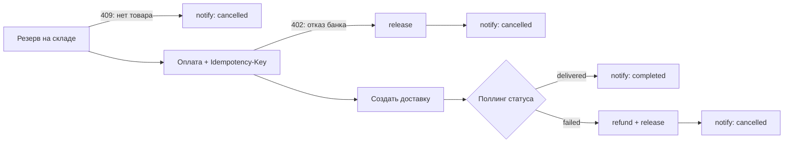

# test_temporal_dev — эксперимент «Temporal vs чистый Python» для ИИ-агентов

Вопрос: что ИИ-агент разработает быстрее — один и тот же интеграционный флоу на
движке оркестрации **Temporal (Python SDK)** или на **чистом Python (asyncio)**?

Метод: оба варианта получают идентичный промпт и изолированный воркспейс;
критерий готовности один — автоматическая проверка `make verify`; время от
старта до первого зелёного verify фиксирует харнесс. Проведено 3 фазы × 3 серии
× 2 варианта = **18 прогонов** одной моделью (copilot-code-large, август 2026).

## Главный результат

| фаза | python (медиана) | temporal (медиана) | temporal/python | красных verify (py / tmp) |
|---|---|---|---|---|
| 1: базовый флоу, со шпаргалками | 3:00 | 4:49 | ×1.6 | 0 / 1 |
| 2: + пережить SIGKILL, со шпаргалками | 2:11 | 4:44 | ×2.2 | 0 / 4 |
| 3: + пережить SIGKILL, БЕЗ шпаргалок | 7:29 | 65:18 | ×8.7 | 1 / 12 |

**Python быстрее во всех 9 парах.** Красных verify за эксперимент: 1 у питона,
17 у temporal.

Выводы:

1. **Главный фактор — подсказки.** Со шпаргалками (готовые куски кода в
   задании) отставание Temporal умеренное: ×1.6–2.2. Без них — почти порядок:
   ×8.7 по медиане, ×23 в худшей паре. Шпаргалка фактически субсидирует
   Temporal.
2. **Durability «из коробки» не конвертировалась в скорость разработки даже на
   профильной задаче.** Придумать механизм выживания — чекпоинты или
   идемпотентный реплей — задача на рассуждение; модель решает её за минуты на
   любом стеке. Часы уходят на специфику самого фреймворка: ограниченная среда
   исполнения workflow-кода, семантика повторного запуска, оркестрация
   worker-процесса, 3–4 файла болерплейта. Сложность Temporal лежит не там,
   где агенту трудно; «трудная» часть питона — там, где агент силён.
3. **Без шпаргалки страдает и качество**: три temporal-агента реализовали три
   разных механизма повторного входа, у двух — латентная дыра (разбор ниже),
   которую одиночный SIGKILL-тест не ловит.

Практический итог:

- Флоу без требований к живучести → агент на питоне в разы быстрее и дешевле,
  Temporal-налог не окупается.
- Живучесть нужна → всё решает наличие рецепта. С рецептом оба стека дёшевы —
  и Temporal можно брать ради эксплуатационных плюсов (история исполнения, UI,
  декларативные ретраи). Без рецепта Temporal-налог — порядок величины плюс
  риск латентных дыр.
- Хочешь агентов на Temporal — вкладывайся в готовый шаблон проекта с
  каноничными паттернами, а не в промпты.

---

## Как устроен эксперимент

### Задание

Агент пишет сервис, который проводит 10 заказов через флоу поверх ненадёжных
внешних сервисов:



Внешние сервисы (склад, платежи, доставка, уведомления) — моки в одном
контейнере. Сбои детерминированы: привязаны к конкретным заказам и счётчикам
попыток, а не к random. Поэтому прогоны воспроизводимы, и чекер вправе
требовать конкретного поведения.

### Сценарная матрица

| заказ | поведение моков | что проверяет |
|---|---|---|
| 1001–1002 | без сбоев | happy path |
| 1003 | склад: первый ответ 500 | ретраи с бэкоффом |
| 1004 | оплата: 500 без записи, затем успех | ретраи на оплате |
| 1005 | оплата: списание записано, но ответ 500 | ретрай обязан идти с тем же Idempotency-Key, иначе двойное списание |
| 1006 | оплата: всегда 402 | компенсация (release); бизнес-отказ не ретраится |
| 1007 | склад: всегда 409 | отмена до оплаты |
| 1008 | доставка завершается failed | сага: refund + release |
| 1009 | уведомления: два 500 подряд | ретраи на последнем шаге |
| 1010 | доставка ~15 секунд | ожидание + конкурентная обработка |

### Критерий готовности

`make verify` сбрасывает моки, запускает `solution/run.sh` и проверяет журнал
всех вызовов API:

- каждый заказ дошёл до правильного терминального статуса, финальное
  уведомление отправлено и идёт последним;
- порядок шагов соблюдён;
- временные 500 ретраились, бизнес-отказы (402/409) — нет;
- нет двойных списаний, суммы совпадают с заказом;
- компенсации выполнены полностью, по отменённым заказам нет лишних действий;
- заказы шли конкурентно (в пике ≥ 8 из 10), прогон уложился в 90 секунд;
- run.sh завершился сам с кодом 0.

В фазах 2–3 добавляется испытание живучести: после трёх успешных списаний
харнесс бьёт **SIGKILL по всей группе процессов решения**, через секунду
запускает `run.sh` повторно и требует, чтобы все заказы дошли до конца — без
потерь и без дублей. В окружении обоих запусков есть `RUN_ID` — стабильный
идентификатор прогона.

### Фазы

| фаза | задание | подсказки в TASK.md | что измеряет |
|---|---|---|---|
| 1 | базовый флоу | полные шпаргалки по обоим стекам, с кодом | скорость при идеальной постановке |
| 2 | + SIGKILL | шпаргалки + готовые рецепты живучести | цена durability при наличии рецепта |
| 3 | + SIGKILL | только факты окружения и ограничения стека, без кода | чистое трение стека; вклад подсказок (сравнение с фазой 2) |

Бизнес-спека (API, политика ретраев, идемпотентность, контракт run.sh) во всех
фазах полная — урезались только подсказки по реализации.

### Честность замера

Идентичный промпт; свежая сессия на каждый прогон; одна модель и настройки;
агент заперт в воркспейсе и не видит чекер и эталоны; порядок вариантов
чередуется между сериями; человек в сессию не вмешивается. Полный протокол —
в [EXPERIMENT.md](EXPERIMENT.md).

---

## Результаты

### Все 18 прогонов

| вариант | фаза | старт | длительность | verify всего | красных |
|---|---|---|---|---|---|
| python | 1 | 08-13 13:15 | 3:00 | 3 | 0 |
| python | 1 | 08-13 14:01 | 3:11 | 1 | 0 |
| python | 1 | 08-13 14:07 | 1:29 | 1 | 0 |
| temporal | 1 | 08-13 13:28 | 3:15 | 2 | 0 |
| temporal | 1 | 08-13 13:55 | 4:49 | 1 | 0 |
| temporal | 1 | 08-13 14:10 | 8:14 | 2 | 1 |
| python | 2 | 08-13 14:48 | 2:44 | 1 | 0 |
| python | 2 | 08-13 15:22 | 1:42 | 1 | 0 |
| python | 2 | 08-13 15:26 | 2:10 | 1 | 0 |
| temporal | 2 | 08-13 14:56 | 10:46 | 3 | 2 |
| temporal | 2 | 08-13 15:18 | 3:12 | 1 | 0 |
| temporal | 2 | 08-13 15:29 | 4:44 | 3 | 2 |
| python | 3 | 08-13 15:41 | 8:51 | 1 | 0 |
| python | 3 | 08-13 19:51 | 7:29 | 2 | 1 |
| python | 3 | 08-14 09:12 | 5:15 | 1 | 0 |
| temporal | 3 | 08-13 15:51 | 65:18 | 2 | 1 |
| temporal | 3 | 08-13 17:00 | 57:38 | 5 | 4 |
| temporal | 3 | 08-14 09:23 | 121:39 | 9 | 7 |

Внутри серий temporal медленнее в ×1.1–3.9 (фазы 1–2) и ×7.4–23 (фаза 3).
Чистое время кодирования до первой попытки verify в фазе 3: python 5–9 минут,
temporal 46–97 минут.

### Стоимость (замерена в серии 1)

| метрика | python | temporal | Δ |
|---|---|---|---|
| стоимость сессии | $1.40 | $1.96 | +40% |
| чистое API-время модели | 1:39 | 2:14 | +35% |
| output-токены | 1.7k | 4.0k | +135% |

### Объём кода (строк, функциональность идентична)

| фаза | python | temporal |
|---|---|---|
| 1 | 110–138 | 226–271 |
| 2 | 96–121 | 246–259 |
| 3 | 158–272 | 294–416 |

Temporal-вариант стабильно ~×2 за счёт болерплейта (workflow + activities +
worker + starter против одного файла).

### Что построили агенты

**Фазы 1–2.** Все решения — аккуратно применённые шпаргалки; отсюда близкие
времена и эффект потолка: сильной модели достаточно готовых кусков.
Единственный красный verify фазы 1 — temporal-агент отступил от шпаргалочной
конвенции вызова activities и сразу получил ошибку строгого API движка.

**Фаза 3, python.** Все три решения сошлись к одной схеме: чекпоинт-файл с
прогрессом по каждому заказу (продолжение с места остановки после рестарта)
плюс стабильный ключ идемпотентности, чтобы повторная оплата не создала второе
списание. Один красный verify — баг в чекпоинте, исправлен за 83 секунды.

**Фаза 3, temporal.** Состояние workflow живёт на сервере и SIGKILL переживает
само; сложность — при повторном запуске корректно подцепиться к существующим
workflow, не создав дубли. Три агента решили это тремя разными способами:

1. подключение к запущенным workflow через политику конфликтов id;
2. переизобретённый каноничный паттерн «отклонить дубль и подцепиться к
   существующему» — ровно тот, что давался в шпаргалке фазы 2 (самое большое
   решение и больше всего красных попыток);
3. перестройка архитектуры на родительский workflow с дочерним на каждый
   заказ — половина решения переписана посреди сессии.

У вариантов 1 и 3 — **латентная дыра**: политика конфликтов id действует
только на запущенные workflow; workflow, успевший завершиться, при рестарте
стартует заново, то есть повторно исполняет шаги — в общем случае это двойное
списание. Одиночный SIGKILL-тест харнесса эту ветку не проверяет; полностью
корректен только вариант 2.

### Оговорки

- n = 3 серии на фазу, одна модель: направление устойчиво (9 пар из 9), точные
  коэффициенты — нет.
- Обрывы связи с API модели приходились в основном на длинные
  temporal-прогоны (длинный прогон дольше экспонирован под внешние сбои).
  Часть их красных verify — проверка состояния после реконнекта, а не ошибки
  кода; времена фаз 2–3 этим шумом завышены. Направление не меняется.
- Два temporal-прогона фазы 3 (65 и 122 мин) превысили лимит 60 минут на
  прогон — им дали завершиться ради данных.
- Измерялись скорость и стоимость **разработки** агентом. Эксплуатационная
  ценность Temporal (наблюдаемость, история исполнения, устойчивость в проде)
  не оценивалась.

---

## Воспроизведение

Требования: Docker Desktop, make, Python ≥ 3.10.

```bash
git clone https://github.com/colzphml/test_temporal_dev.git && cd test_temporal_dev
make up        # temporal + моки (первый запуск качает ~1 ГБ)
make selftest  # самопроверка стенда: 14 шагов, ~10 минут
```

В селфтесте будут **пять запланированных «VERIFY FAILED»** — проверка, что
чекер бракует пустые и испорченные решения. Критерий — итоговая строка
`✅ СЕЛФТЕСТ ПРОЙДЕН (14/14)`.

Один прогон (детали — [EXPERIMENT.md](EXPERIMENT.md)):

```bash
make workspace VARIANT=python PHASE=3 FORCE=1   # PHASE: пусто = 1, или 2, или 3
make begin VARIANT=python MODEL="<модель>"
cd runs/python && claude --permission-mode acceptEdits
# промпт: Прочитай TASK.md в текущей папке и выполни задачу полностью.
#         Готово, когда make verify зелёный.
# дождаться 🏁 → снять /cost → cd ../.. → make archive VARIANT=python
make report
```

## Структура репозитория

```
docker-compose.yml   стенд: Temporal (auto-setup + postgres + ui + admin-tools) и моки
mocks/               моки 4 бизнес-сервисов + чекер (один процесс, общий журнал вызовов)
spec/                задание: SPEC.md + фазовые и вариантные части + шаблоны воркспейса
scripts/             харнесс: workspace, verify (SIGKILL/restart), timer, selftest
reference/           эталонные решения всех фаз — только для селфтеста
runs/                воркспейсы прогонов (генерируются, в git не попадают)
results/             замеры и архив решений (на машине эксперимента)
```

| адрес | что |
|---|---|
| http://localhost:8100 | моки; отладка: `/admin/state`, `/admin/ledger` |
| localhost:7233 | Temporal gRPC |
| http://localhost:8233 | Temporal UI |

Ключевые решения стенда:

- **REST-моки вместо Kafka** — очередь ничего не добавляет сравнению
  «оркестратор vs ручной код», а стенд утяжеляет.
- **Детерминированные сбои** — без них прогоны несравнимы, а чекер не может
  требовать конкретных ретраев.
- **Чекер в контейнере моков** — общий журнал вызовов, ноль зависимостей на
  хосте, одинаков для обоих вариантов.
- **Инвариант конкурентности вместо жёсткого тайм-бюджета** — в Temporal
  каждый шаг и таймер проходят через сервер, исполнение объективно медленнее
  (~2.3с на цикл поллинга против ~1с у питона); жёсткий лимит штрафовал бы
  стек, а не решение.
- **NO_PROXY в харнесе** — системный прокси macOS перехватывал у
  python-клиентов запросы к localhost (curl при этом работал); стенд
  нейтрализует это сам, чтобы агенты не тратили время на проблему окружения.
- **Зависимости предустановлены в venv воркспейса** — измеряется разработка,
  а не скорость pip.
