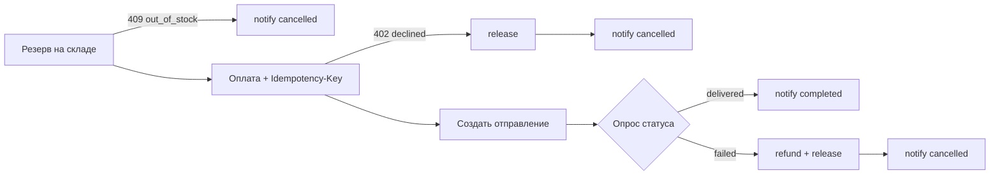

# test_temporal_dev — эксперимент «Temporal vs чистый Python» для ИИ-агентов

Вопрос: что ИИ-агент разрабатывает быстрее — один и тот же интеграционный флоу
на **Temporal (Python SDK)** или на **чистом Python (asyncio)**? Метод: обоим
вариантам выдаётся одинаковый промпт и изолированный воркспейс, готовность
определяет только автоматический судья (`make verify`), время меряет харнесс.
Проведено 3 фазы × 3 серии × 2 варианта = 18 прогонов (модель
copilot-code-large, август 2026).

## TL;DR — результаты

| фаза | python (медиана) | temporal (медиана) | temporal/python | красных verify (py / tmp) |
|---|---|---|---|---|
| 1: базовый флоу + чит-шиты | 3:00 | 4:49 | ×1.6 | 0 / 1 |
| 2: + живучесть (SIGKILL) + чит-шиты | 2:11 | 4:44 | ×2.2 | 0 / 4 |
| 3: живучесть БЕЗ подсказок | 7:29 | 65:18 | ×8.7 | 1 / 12 |

**Python оказался быстрее во всех 9 парах из 9.** За весь эксперимент — 1
красный verify у питона против 17 у temporal.

Главные выводы:

1. **Подсказки — главный модератор результата.** С готовыми рецептами в задании
   разрыв ×1.6–2.2; без них — почти порядок величины (худшая пара ×23).
   Чит-шит фактически субсидирует Temporal.
2. **«Durability из коробки» не конвертировалась в скорость агентной
   разработки даже в профильной фазе.** Концептуальную часть живучести
   (идемпотентный реплей / чекпоинты) сильная модель придумывает за минуты;
   операционная сложность Temporal SDK (песочница workflow, политики
   conflict/reuse, worker-оркестрация, 4 файла болерплейта) без шпаргалки
   стоит часы. Сложность Temporal лежит не там, где агенту трудно, а
   «трудная» часть питона — ровно там, где агент силён (рассуждение).
3. **Качество тоже страдает без рецепта**: в фазе 3 три temporal-агента
   переизобрели три разных механизма повторного входа, и два из трёх несут
   латентную дыру («completed workflow + рестарт = дубль запуска»), которую
   одиночный SIGKILL-тест не ловит.

Практическая формула:

- Флоу без требований к живучести → агент на чистом питоне в разы быстрее и
  дешевле; Temporal-налог не окупается.
- Живучесть нужна → всё решает наличие рецепта. С рецептом оба стека дёшевы —
  и можно брать Temporal ради рантайм-плюшек (UI, история, декларативные
  ретраи). Без рецепта Temporal-налог для агента — порядок величины плюс риск
  латентных дыр.
- Хочешь, чтобы агенты писали на Temporal — инвестируй не в промпты, а в
  скаффолд/шаблон с каноничными паттернами.

---

## Что именно проверялось

### Задание: обработка заказов интернет-магазина

Агент получает 10 заказов (`GET /api/orders`) и обязан провести каждый через
флоу поверх нарочно ненадёжных мок-сервисов:



Сервисы (один FastAPI-контейнер, 4 логических API: склад, платежи, доставка,
уведомления) ведут себя детерминированно — сбои привязаны к order_id и
счётчикам попыток, поэтому прогоны воспроизводимы, а чекер может требовать
конкретного поведения. Сценарная матрица:

| заказ | поведение моков | что проверяет у решения |
|---|---|---|
| ORD-1001, 1002 | всё успешно | happy path |
| ORD-1003 | reserve: первый ответ 500 | ретраи на первом шаге |
| ORD-1004 | charge: 500 без записи, потом успех | ретраи оплаты |
| ORD-1005 | charge: списание **записано**, но ответ 500 | идемпотентность: ретрай с тем же ключом; новый ключ = двойное списание |
| ORD-1006 | charge: всегда 402 | компенсация release; 402 не ретраится |
| ORD-1007 | reserve: всегда 409 | отмена без оплаты |
| ORD-1008 | доставка завершается failed | сага: refund + release |
| ORD-1009 | notify: два 500 подряд | ретраи на последнем шаге |
| ORD-1010 | медленная доставка (~15с) | ожидание + конкурентность |

### Судья: инварианты `make verify`

Verify сбрасывает моки, запускает `solution/run.sh` и оценивает журнал всех
вызовов API (чекер живёт в контейнере моков, вердикт — `GET /admin/check`):

1. Каждый заказ дошёл до правильного терминального статуса, финальное
   уведомление — последним шагом.
2. Порядок шагов внутри заказа (резерв → оплата → отправление → доставка →
   уведомление).
3. Ретраи выполнены там, где сервисы отвечали 500 (мало попыток = провал).
4. Нет двойных списаний; суммы совпадают с заказом.
5. Компенсации: release при 402; refund + release при провале доставки; ничего
   лишнего по отменённым заказам.
6. Конкурентность: интервалы обработки заказов пересекаются (в пике ≥ 8 из 10
   одновременно) + мягкий лимит 90с на весь прогон.
7. `run.sh` завершился сам с кодом 0.

В фазах 2–3 добавляется: после трёх успешных списаний харнесс бьёт **SIGKILL
по всей группе процессов решения**, через секунду запускает `run.sh` заново, и
чекер дополнительно требует «разрыв пережит» (списания до kill, уведомления
после) при сохранении всех инвариантов — в первую очередь «ровно одно списание
на заказ». В окружении обоих запусков есть `RUN_ID` — стабильный идентификатор
прогона (одинаковый внутри одного verify, разный между verify).

### Фазы

| фаза | задание | подсказки в TASK.md | что измеряет |
|---|---|---|---|
| 1 | базовый флоу | полные чит-шиты обоих стеков (сниппеты, скелеты файлов, RetryPolicy, песочница) | скорость на «идеальной» спеке |
| 2 | + пережить SIGKILL | чит-шиты + рецепты живучести (идемпотентный реплей; REJECT_DUPLICATE + attach) | цена durability при наличии рецепта |
| 3 | + пережить SIGKILL | **только факты окружения и ограничения стека, ни строчки кода** (селфтест проверяет отсутствие код-фенсов) | чистое трение стеков; вклад подсказок (сравнением с фазой 2) |

Бизнес-спека (API, таблица ретраев, правило Idempotency-Key, контракт run.sh)
во всех фазах полная — это задание, а не подсказки.

### Протокол замера

- Стартовый промпт обеих сессий идентичен; вся разница вариантов — внутри
  воркспейса (`TASK.md`). Сессии свежие, модель и настройки одинаковые,
  `--permission-mode acceptEdits` (чтобы не мерить клики человека).
- Время = от `make begin` до первого зелёного verify (фиксируется
  автоматически); вторичные метрики: число красных verify, /cost, размер кода.
- Порядок вариантов чередуется между сериями; ≥3 серии на фазу; вмешиваться в
  сессию нельзя. Полный протокол и правила честности — в
  [EXPERIMENT.md](EXPERIMENT.md).

---

## Результаты

### Все 18 прогонов

| вариант | фаза | старт | длительность | verify всего | неудачных |
|---|---|---|---|---|---|
| python | 1 | 08-13 13:15 | 3:00 | 3 | 0 |
| python | 1 | 08-13 14:01 | 3:11 | 1 | 0 |
| python | 1 | 08-13 14:07 | 1:29 | 1 | 0 |
| temporal | 1 | 08-13 13:28 | 3:15 | 2 | 0 |
| temporal | 1 | 08-13 13:55 | 4:49 | 1 | 0 |
| temporal | 1 | 08-13 14:10 | 8:14 | 2 | 1 |
| python | 2 | 08-13 14:48 | 2:44 | 1 | 0 |
| python | 2 | 08-13 15:22 | 1:42 | 1 | 0 |
| python | 2 | 08-13 15:26 | 2:10 | 1 | 0 |
| temporal | 2 | 08-13 14:56 | 10:46 | 3 | 2 |
| temporal | 2 | 08-13 15:18 | 3:12 | 1 | 0 |
| temporal | 2 | 08-13 15:29 | 4:44 | 3 | 2 |
| python | 3 | 08-13 15:41 | 8:51 | 1 | 0 |
| python | 3 | 08-13 19:51 | 7:29 | 2 | 1 |
| python | 3 | 08-14 09:12 | 5:15 | 1 | 0 |
| temporal | 3 | 08-13 15:51 | 65:18 | 2 | 1 |
| temporal | 3 | 08-13 17:00 | 57:38 | 5 | 4 |
| temporal | 3 | 08-14 09:23 | 121:39 | 9 | 7 |

Попарно внутри серий temporal медленнее в ×1.09–×3.9 (фазы 1–2) и ×7.4–×23.2
(фаза 3). Время до *первой попытки* verify (чистое написание кода) в фазе 3:
python 5–9 минут, temporal 46–97 минут.

### Стоимость (замерена в серии 1 фазы 1)

| метрика | python | temporal | Δ |
|---|---|---|---|
| стоимость сессии | $1.40 | $1.96 | +40% |
| API-время | 1:39 | 2:14 | +35% |
| output-токены | 1.7k | 4.0k | +135% |

### Размер решений (строк кода на идентичную функциональность)

| фаза | python | temporal |
|---|---|---|
| 1 | 110–138 | 226–271 |
| 2 | 96–121 | 246–259 |
| 3 | 158–272 | 294–416 |

### Что построили агенты

- **Фазы 1–2**: все решения — аккуратно применённые чит-шиты; отсюда «эффект
  потолка» (сильная модель one-shot'ит оба варианта). Единственный красный
  verify фазы 1 случился, когда temporal-агент отошёл от dict-конвенции
  чит-шита в зону мультиаргументных activities (`args=[...]`). В фазе 2
  требование живучести с рецептом оказалось бесплатным обоим: python даже
  ускорился (замена uuid-ключа на `pay-{oid}-{RUN_ID}`).
- **Фаза 3, python**: все трое самостоятельно выбрали чекпоинт-файлы
  (`state_{RUN_ID}.json`, пер-заказные json, атомарная запись tmp+rename),
  ключ идемпотентности детерминированный или персистится в чекпоинте. Один
  красный verify (баг чекпоинта, починен за 83с).
- **Фаза 3, temporal**: три разных механизма повторного входа: (1)
  `id_conflict_policy=USE_EXISTING`; (2) канонический `REJECT_DUPLICATE` +
  catch `WorkflowAlreadyStartedError` + `get_workflow_handle` — рецепт фазы 2,
  переоткрытый с нуля; (3) родительский batch-workflow с child-workflow на
  заказ (архитектура переписана посреди сессии). Варианты (1) и (3) несут
  латентную дыру: `USE_EXISTING` касается только бегущих workflow, завершённый
  при рестарте запускается заново (двойное исполнение); одиночный SIGKILL-тест
  этого не ловит. В коде остались шрамы борьбы с песочницей
  («Access cause via hasattr — avoids sandbox class mismatch»).

### Ограничения и угрозы валидности

- n = 3 серии на фазу, одна модель (copilot-code-large): направление устойчиво
  (9/9 пар), точные величины — нет.
- Реконнекты API модели приходились в основном на длинные (temporal) прогоны —
  часть красных verify это «пробы состояния» после обрыва, величины фаз 2–3
  этим шумом завышены. Асимметрия экспозиции: длинный прогон собирает больше
  внешнего шума.
- Два temporal-прогона фазы 3 (65 и 122 мин) формально за DNF-лимитом 60 мин —
  им дали дойти до конца ради данных.
- Эффект потолка в фазах 1–2: подробные чит-шиты снимали трение стека.
- Рантайм-ценность Temporal (наблюдаемость, история, устойчивость в проде)
  экспериментом не измерялась — только скорость и стоимость агентной
  разработки.

---

## Воспроизведение

Требования: Docker Desktop, make, Python ≥ 3.10 (brew `python@3.13` подходит).

```bash
git clone https://github.com/colzphml/test_temporal_dev.git && cd test_temporal_dev
make up        # temporal + моки (первый раз качает ~1 ГБ)
make selftest  # самопроверка стенда: 14 шагов, ~10 мин
```

В выводе селфтеста будут **пять запланированных «VERIFY FAILED»** (проверка,
что чекер бракует пустые и испорченные решения) — смотри на итог
`✅ СЕЛФТЕСТ ПРОЙДЕН (14/14)`.

Один прогон (подробно — [EXPERIMENT.md](EXPERIMENT.md)):

```bash
make workspace VARIANT=python PHASE=3 FORCE=1   # PHASE: пусто=1, 2, 3
make begin VARIANT=python MODEL="<модель>"
cd runs/python && claude --permission-mode acceptEdits
# промпт: Прочитай TASK.md в текущей папке и выполни задачу полностью.
#         Готово, когда make verify зелёный.
# ждать 🏁 → /cost → cd ../.. → make archive VARIANT=python
make report
```

## Устройство стенда

```
docker-compose.yml   temporal (auto-setup 1.29.7 + postgres 16 + ui + admin-tools) и моки
mocks/               FastAPI-моки 4 сервисов + чекер-судья (в одном процессе с журналом)
spec/                задание: SPEC.md + фазовые и вариантные части + шаблоны воркспейса
scripts/             харнесс: workspace, verify (kill/restart), timer, selftest, preflight
reference/           эталонные решения всех фаз — только для селфтеста стенда
runs/                воркспейсы прогонов (генерируются, в git не попадают)
results/             замеры, отчёты, архив решений (живут на машине эксперимента)
```

| адрес | что |
|---|---|
| http://localhost:8100 | моки (`/admin/state`, `/admin/ledger` — отладка) |
| localhost:7233 | Temporal gRPC |
| http://localhost:8233 | Temporal Web-UI |

Ключевые инженерные решения:

- **REST-моки вместо Kafka**: сравнению «оркестратор vs ручной код» кафка
  ничего не добавляет, стенд тяжелеет (идея для будущей фазы — триггер из топика).
- **Детерминированные сбои вместо random** — воспроизводимость и проверяемость
  ретраев.
- **Чекер внутри контейнера моков** — общая память с журналом, ноль зависимостей
  на хосте, одинаков для обоих вариантов.
- **Инвариант конкурентности вместо жёсткого бюджета времени**: у Temporal
  каждый цикл опроса — durable-таймер + activity (~2.3с против ~1с у питона);
  жёсткий бюджет штрафовал бы стек, а не решение.
- **NO_PROXY в харнесе**: системный прокси macOS перехватывает у python-клиентов
  запросы к localhost (curl при этом работает) — стенд нейтрализует это сам.
- **Зависимости предустановлены в venv воркспейса** — меряем разработку, а не
  скорость pip и Wi-Fi.

Отладка: `make ps`, `make logs`, `make clean && make up` (полный пересбор),
`make reset` (сброс моков).
