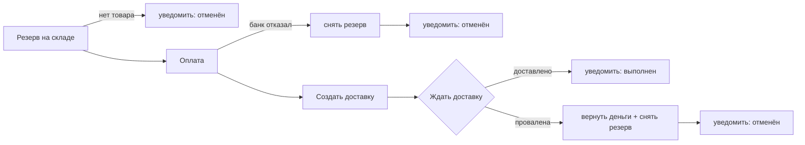

# test_temporal_dev — эксперимент «Temporal vs чистый Python» для ИИ-агентов

Вопрос: если поручить ИИ-агенту написать один и тот же интеграционный процесс,
что получится быстрее — вариант на движке оркестрации **Temporal** или на
**обычном Python**?

Метод, кратко: оба варианта получают одинаковый промпт и одинаковое задание;
«готово» определяет автоматическая проверка (`make verify`); время от старта
сессии до первой зелёной проверки фиксируется автоматически. Проведено
3 фазы × 3 серии × 2 варианта = **18 прогонов** одной и той же моделью
(copilot-code-large, август 2026).

## Главный результат

| фаза | python (медиана) | temporal (медиана) | temporal медленнее в | красных проверок (py / tmp) |
|---|---|---|---|---|
| 1: базовый процесс, со шпаргалками | 3:00 | 4:49 | ×1.6 | 0 / 1 |
| 2: + пережить убийство процесса, со шпаргалками | 2:11 | 4:44 | ×2.2 | 0 / 4 |
| 3: то же, но БЕЗ шпаргалок | 7:29 | 65:18 | ×8.7 | 1 / 12 |

**Python оказался быстрее во всех 9 парах из 9.** Красных проверок за весь
эксперимент: 1 у питона против 17 у temporal.

Три вывода:

1. **Всё решают подсказки.** Пока в задании есть шпаргалка с готовыми кусками
   кода, отставание Temporal умеренное (×1.6–2.2). Убрали шпаргалку —
   отставание выросло почти в десять раз (в худшей паре ×23). Хорошая
   шпаргалка — это, по сути, субсидия Temporal'у.
2. **Обещание «устойчивость из коробки» не превратилось в скорость разработки
   даже на профильной задаче.** Придумать, *как* пережить сбой (сохранять
   прогресс или сделать шаги безопасно повторяемыми), — задача на рассуждение;
   сильная модель решает её за минуты на любом стеке. А вот совладать с самим
   Temporal — его особой средой исполнения кода, правилами повторного запуска,
   отдельным процессом-исполнителем и несколькими файлами служебного кода —
   без шпаргалки стоит часы. Сложность Temporal лежит не там, где агенту
   трудно; а «трудная» часть питона — ровно там, где агент силён.
3. **Без шпаргалки страдает и качество.** Три temporal-агента собрали три
   разных механизма «продолжить после рестарта», и в двух из трёх осталась
   скрытая дыра, которую наш тест не задевает, а реальная жизнь — задела бы
   (разбор ниже).

Практический итог:

- Процесс без требований к живучести → агент на обычном питоне в разы быстрее
  и дешевле; налог на Temporal не окупается.
- Живучесть нужна → всё решает наличие готового рецепта. С рецептом оба стека
  дёшевы — и тогда Temporal можно брать ради его эксплуатационных плюсов
  (история исполнения, наглядный интерфейс, повторы «из коробки»). Без
  рецепта налог на Temporal — порядок величины плюс риск скрытых дыр.
- Хочешь, чтобы агенты писали на Temporal, — вкладывайся не в промпты, а в
  готовый шаблон проекта с правильными приёмами.

---

## Как устроен эксперимент

### Задача, которую решает агент

Написать сервис, который проводит 10 заказов интернет-магазина через процесс:



Вокруг — четыре «внешних сервиса»: склад, платежи, доставка, уведомления.
На самом деле это имитация (один контейнер), которая ведёт себя как настоящие
капризные API: временами отвечает ошибкой 500, временами отказывает по
бизнес-причинам. Сбои не случайны, а заранее прописаны по конкретным заказам —
поэтому каждый прогон воспроизводим, и проверка вправе требовать конкретного
поведения.

### Ловушки, зашитые в заказы

| заказ | что происходит | что это проверяет у решения |
|---|---|---|
| 1001–1002 | всё гладко | базовый сценарий |
| 1003 | склад один раз отвечает 500 | повтор запроса при временном сбое |
| 1004 | платёжка один раз отвечает 500 | то же на шаге оплаты |
| 1005 | деньги списались, но ответ «потерялся» (500) | самая коварная: повторную попытку надо делать с тем же ключом операции, иначе клиент заплатит дважды |
| 1006 | банк окончательно отказывает | откат (снять резерв) и умение не долбить банк повторами |
| 1007 | товара нет на складе | отмена до оплаты |
| 1008 | доставка проваливается | двойной откат: вернуть деньги и снять резерв |
| 1009 | уведомления дважды отвечают 500 | повторы даже на последнем шаге |
| 1010 | доставка едет ~15 секунд | умение ждать и вести заказы параллельно |

### Что значит «готово»

`make verify` сбрасывает имитацию, запускает решение агента и сверяет журнал
всех обращений к сервисам:

- каждый заказ пришёл к правильному финалу, и об этом отправлено уведомление;
- шаги шли в правильном порядке;
- временные сбои повторялись, бизнес-отказы — нет;
- ни одного двойного списания, суммы верные;
- откаты выполнены полностью; по отменённым заказам нет лишних действий;
- заказы шли параллельно (в пике ≥ 8 из 10), весь прогон уложился в 90 секунд;
- решение завершилось само и без ошибок.

В фазах 2–3 добавляется главное испытание: в разгаре работы стенд **жёстко
убивает процесс решения** (kill -9, без предупреждения), через секунду
запускает его заново — и требует, чтобы все заказы всё равно доехали до конца:
ничего не потеряно, ничего не сделано дважды.

### Три фазы

| фаза | задание | подсказки в задании | что измеряет |
|---|---|---|---|
| 1 | базовый процесс | подробная шпаргалка по каждому стеку, с готовыми кусками кода | скорость при идеальной постановке |
| 2 | + пережить убийство процесса | шпаргалка + готовые рецепты выживания | цена устойчивости, когда рецепт дан |
| 3 | + пережить убийство процесса | только описание окружения и ограничения стека, ни строчки кода | настоящее трение стека; вклад подсказок (сравнение с фазой 2) |

Бизнес-требования во всех фазах описаны полностью — урезались только
подсказки «как это сделать».

### Честность замера

Одинаковый промпт слово в слово; свежая сессия на каждый прогон; одна модель и
настройки; агент работает в изолированной папке и не видит ни проверяющего, ни
эталонов; порядок вариантов чередуется между сериями; человек в сессию не
вмешивается. Время меряет стенд: от команды старта до первой зелёной проверки.
Полный протокол — в [EXPERIMENT.md](EXPERIMENT.md).

---

## Результаты

### Все 18 прогонов

| вариант | фаза | старт | длительность | проверок всего | красных |
|---|---|---|---|---|---|
| python | 1 | 08-13 13:15 | 3:00 | 3 | 0 |
| python | 1 | 08-13 14:01 | 3:11 | 1 | 0 |
| python | 1 | 08-13 14:07 | 1:29 | 1 | 0 |
| temporal | 1 | 08-13 13:28 | 3:15 | 2 | 0 |
| temporal | 1 | 08-13 13:55 | 4:49 | 1 | 0 |
| temporal | 1 | 08-13 14:10 | 8:14 | 2 | 1 |
| python | 2 | 08-13 14:48 | 2:44 | 1 | 0 |
| python | 2 | 08-13 15:22 | 1:42 | 1 | 0 |
| python | 2 | 08-13 15:26 | 2:10 | 1 | 0 |
| temporal | 2 | 08-13 14:56 | 10:46 | 3 | 2 |
| temporal | 2 | 08-13 15:18 | 3:12 | 1 | 0 |
| temporal | 2 | 08-13 15:29 | 4:44 | 3 | 2 |
| python | 3 | 08-13 15:41 | 8:51 | 1 | 0 |
| python | 3 | 08-13 19:51 | 7:29 | 2 | 1 |
| python | 3 | 08-14 09:12 | 5:15 | 1 | 0 |
| temporal | 3 | 08-13 15:51 | 65:18 | 2 | 1 |
| temporal | 3 | 08-13 17:00 | 57:38 | 5 | 4 |
| temporal | 3 | 08-14 09:23 | 121:39 | 9 | 7 |

Внутри каждой серии temporal медленнее: в ×1.1–3.9 (фазы 1–2) и в ×7.4–23
(фаза 3). Показательно чистое время написания кода до первой же попытки
проверки в фазе 3: питон — 5–9 минут, temporal — 46–97 минут.

### Стоимость (замерена в первой серии)

| метрика | python | temporal | разница |
|---|---|---|---|
| стоимость сессии | $1.40 | $1.96 | +40% |
| чистое время работы модели | 1:39 | 2:14 | +35% |
| сгенерировано токенов | 1.7k | 4.0k | +135% |

### Объём кода (строк — при одинаковой функциональности)

| фаза | python | temporal |
|---|---|---|
| 1 | 110–138 | 226–271 |
| 2 | 96–121 | 246–259 |
| 3 | 158–272 | 294–416 |

Проверка одна и та же, то есть функционально решения эквивалентны:
temporal-вариант стабильно в ~2 раза больше за счёт служебного кода.

### Что агенты построили

**Фазы 1–2.** Оба варианта — фактически аккуратно применённые шпаргалки;
отсюда близкие времена: сильной модели достаточно готовых кусков. Единственная
красная проверка фазы 1 случилась, когда temporal-агент решил вызывать шаги
«по-своему», не как в шпаргалке, — и сразу споткнулся об строгий API движка.

**Фаза 3, python.** Все трое, не сговариваясь, пришли к одному решению по
сути: сохранять прогресс каждого заказа в файл и после рестарта продолжать с
места остановки, а ключ платежа держать постоянным — чтобы повтор не списал
деньги дважды. Одна красная проверка (ошибка в сохранении прогресса), починена
за полторы минуты.

**Фаза 3, temporal.** Сильная сторона движка в том, что состояние процессов
живёт на его сервере и рестарт им не страшен, — но этим надо правильно
воспользоваться: при повторном запуске *подключиться* к уже идущим процессам,
а не наплодить новых. Три агента сделали это тремя разными способами: первый —
через «подключение к живому процессу»; второй с нуля переизобрёл канонический
приём (ровно тот, что мы давали в шпаргалке фазы 2) — на это ушло больше всего
кода и попыток; третий перестроил архитектуру на процесс-родитель с дочерним
процессом на каждый заказ, переписав половину решения посреди сессии. У
первого и третьего осталась **скрытая дыра**: их способ подключения работает
только с *живыми* процессами, а процесс, успевший завершиться, при рестарте
запустится заново — в общем случае это повторное исполнение и двойное
списание. Наш одиночный тест на убийство эту ситуацию не задевает, но в
реальной эксплуатации она бы стрельнула.

### Оговорки

- По 3 серии на фазу и одна модель: направление результата устойчиво (9 пар из
  9), точные коэффициенты — нет.
- У сессий агента случались обрывы связи с API модели, и доставались они в
  основном длинным temporal-прогонам. Часть их красных проверок — это «а что
  вообще успело сделаться?» после обрыва, а времена фаз 2–3 таким шумом
  завышены. Направление результата это не меняет.
- Два temporal-прогона фазы 3 (65 и 122 минуты) вышли за оговорённый лимит в
  60 минут — им дали доработать ради данных.
- Эксперимент мерил скорость и стоимость **разработки** агентом. Ценность
  Temporal в **эксплуатации** (наблюдаемость, история исполнения, устойчивость
  в проде) не оценивалась — это отдельный вопрос.

---

## Как повторить

Нужны Docker Desktop, make и Python ≥ 3.10.

```bash
git clone https://github.com/colzphml/test_temporal_dev.git && cd test_temporal_dev
make up        # поднять Temporal и моки (первый раз качает ~1 ГБ)
make selftest  # самопроверка стенда, ~10 минут
```

В самопроверке будут **пять запланированных «VERIFY FAILED»** — так стенд
доказывает, что умеет браковать пустые и испорченные решения. Важна итоговая
строка: `✅ СЕЛФТЕСТ ПРОЙДЕН (14/14)`.

Один прогон (подробности — [EXPERIMENT.md](EXPERIMENT.md)):

```bash
make workspace VARIANT=python PHASE=3 FORCE=1   # PHASE: пусто = фаза 1, или 2, или 3
make begin VARIANT=python MODEL="<модель>"
cd runs/python && claude --permission-mode acceptEdits
# промпт: Прочитай TASK.md в текущей папке и выполни задачу полностью.
#         Готово, когда make verify зелёный.
# дождаться 🏁 → снять /cost → cd ../.. → make archive VARIANT=python
make report    # сводная таблица прогонов
```

## Что в репозитории

```
docker-compose.yml   стенд: Temporal и контейнер с моками
mocks/               имитация 4 бизнес-сервисов + проверяющий (видит журнал всех вызовов)
spec/                задание агенту: общая часть + фазовые и вариантные части
scripts/             механика: создание воркспейса, verify (с убийством процесса), таймер, самопроверка
reference/           эталонные решения — только для самопроверки стенда
runs/                рабочие папки прогонов (создаются командой, в git не попадают)
results/             замеры и архив решений (живут на машине, где шёл эксперимент)
```

| адрес | что там |
|---|---|
| http://localhost:8100 | моки; `/admin/state` и `/admin/ledger` — посмотреть, что происходило |
| localhost:7233 | Temporal (для решений) |
| http://localhost:8233 | веб-интерфейс Temporal |

Несколько решений, важных для честности стенда:

- **Сбои прописаны, а не случайны** — иначе прогоны нельзя сравнивать, а
  проверка не может требовать конкретных повторов.
- **Проверяющий живёт рядом с моками** и судит по полному журналу вызовов — на
  хосте ему ничего не нужно, для обоих вариантов он одинаков.
- **Вместо жёсткого лимита времени — проверка параллельности.** В Temporal
  каждый шаг проходит через сервер и объективно исполняется медленнее; жёсткий
  лимит наказывал бы стек, а не решение.
- **Обход системного прокси macOS**: он перехватывал у питоновских
  HTTP-клиентов обращения к localhost (при работающем curl) — стенд решает это
  сам, чтобы агенты не тратили время на чужую проблему.
- **Зависимости заранее установлены** в окружение воркспейса — меряем
  разработку, а не скорость интернета.
